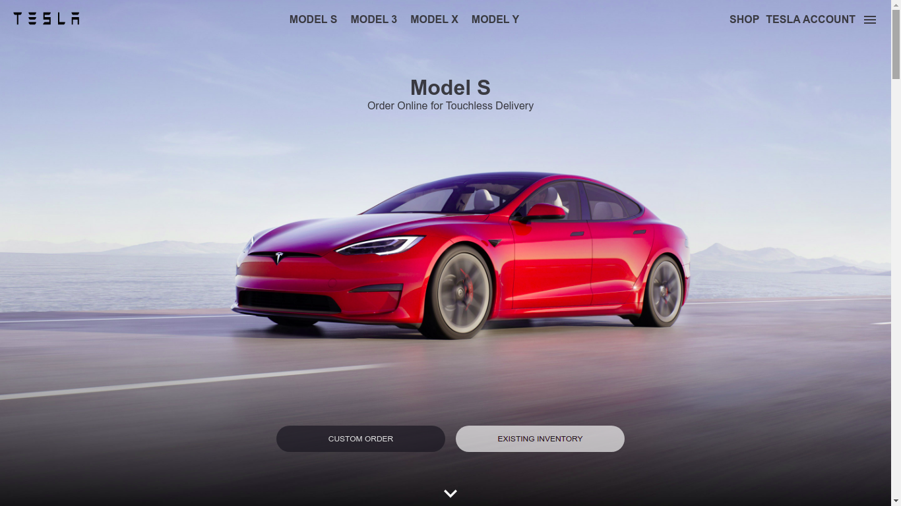
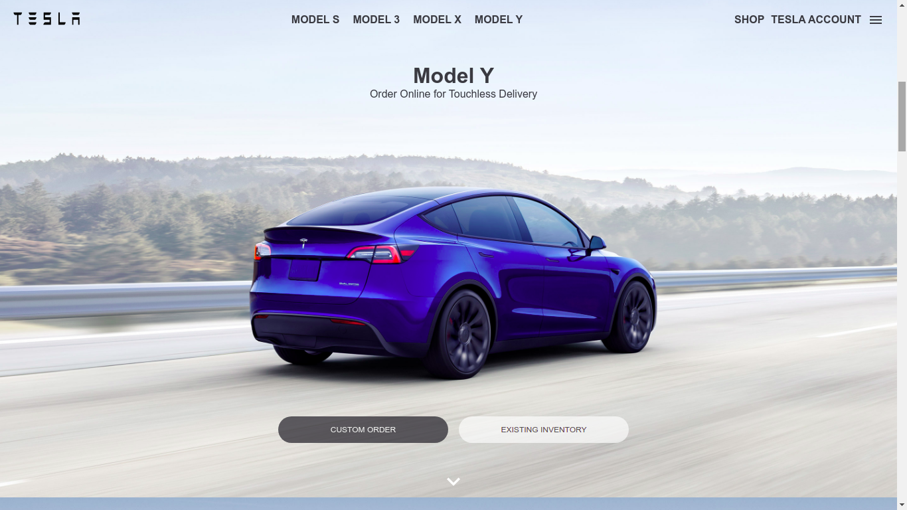
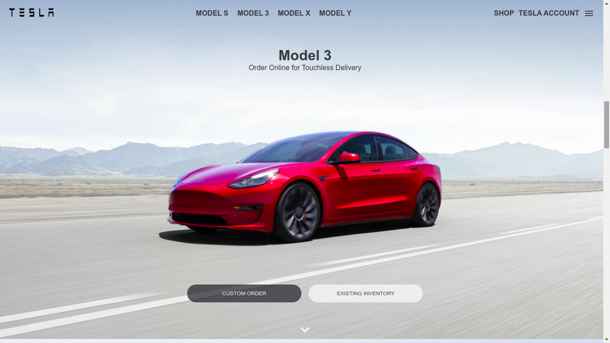
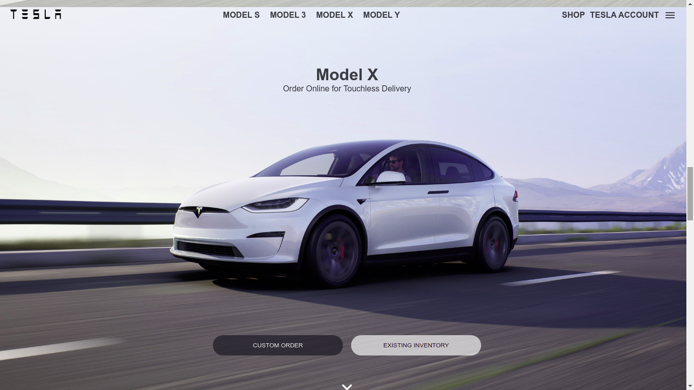
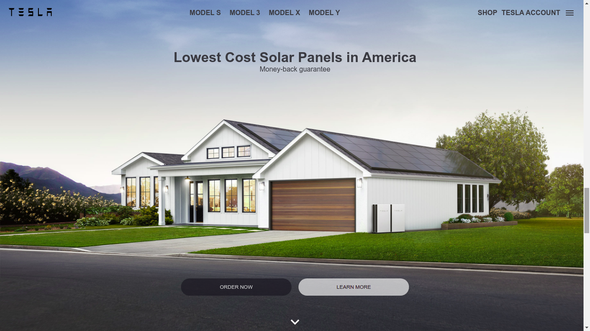

# Tesla Clone 

## Introduction
This is a code repository of the responsive UI clone of Tesla homepage built with React, Redux, React-Reveal and Styled-components

## Hosted on
https://tesla-clone-666424.netlify.app/

## Stay up to date with new projects
New major projects coming soon. To stay up to date, keep checking : https://prakshh.github.io/